## D3.js - Data Driven Documents
Ottmar Gobrecht  
DOAG APEX connect 2015, Düsseldorf

<!--slide-container-->

## Aufwärmrunde

<!--slide-->

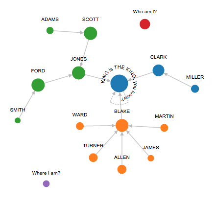

<!--slide-->

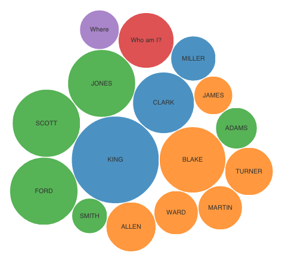

<!--slide-->

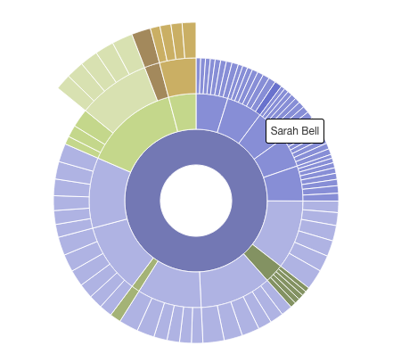

<!--slide-->

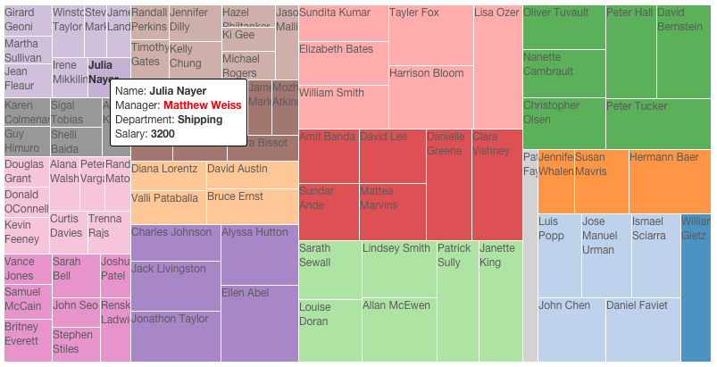

<!--slide-->

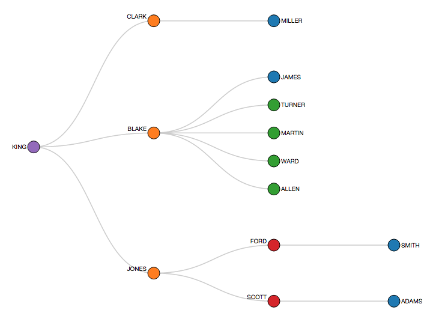

<!--slide-->

### Zum selber schauen:

[d3js.org](http://d3js.org/)  
[github.com/mbostock/d3/wiki/Gallery](https://github.com/mbostock/d3/wiki/Gallery)

<!--slide-->

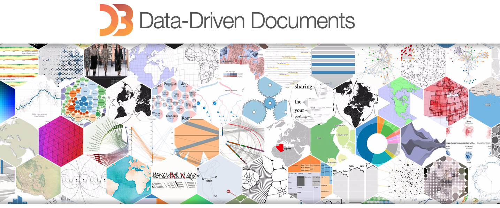

<!--slide-->

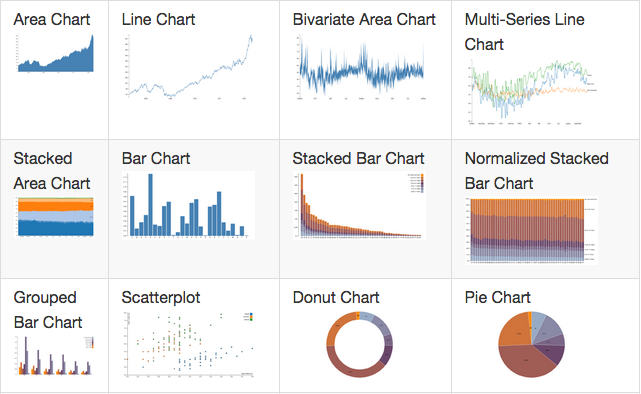

<!--slide-->

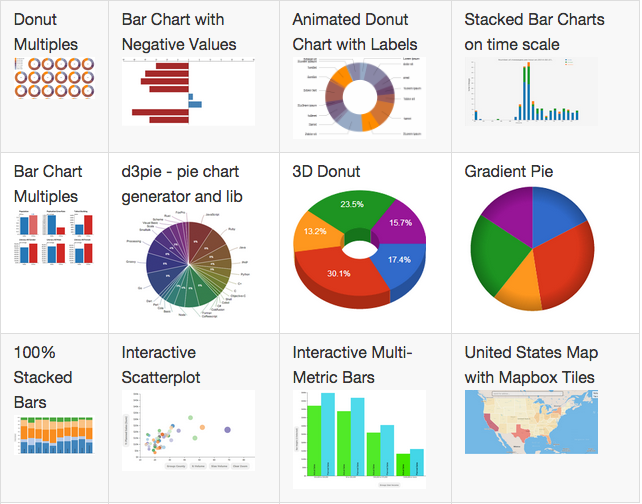

<!--slide-->

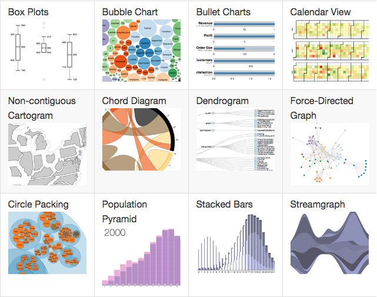

<!--slide-->

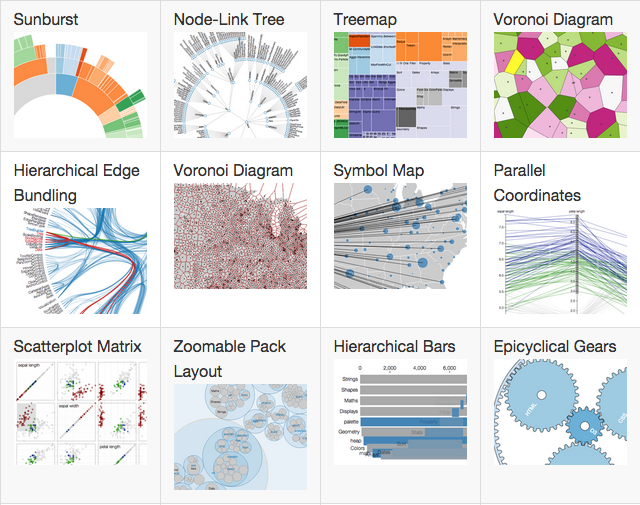

<!--slide-->

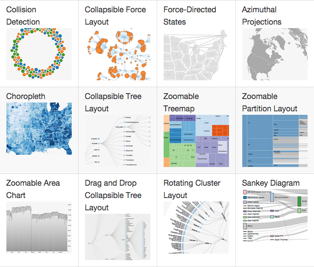

<!--slide-->


<!--slide-->

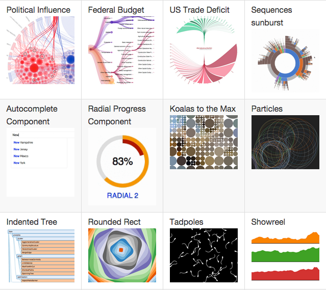

<!--slide-->

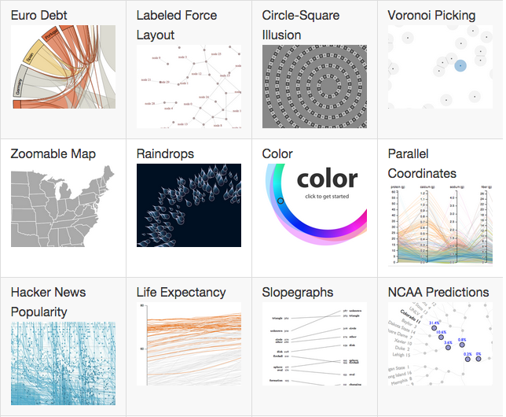

<!--slide-->

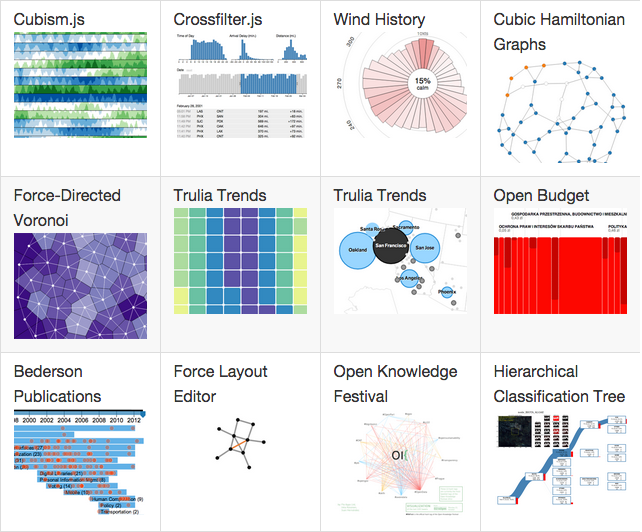

<!--slide-->

Das könnte immer so weiter gehen ...

<!--slide-container-->

## Der Versuch einer Definition

<!--slide-->

### D3.js - Was ist das?

- Eine JavaScript Entwicklerbibliothek
- Verbindet Daten und grafische Elemente im Browser
- Auch bei großen Datenmengen sehr schnell
- Basiert auf Webstandards HTML5, CSS3, SVG (zukunftssicher und mobil lauffähig)
- KEINE Chart-Engine mit fertigen Layouts


<!--slide-container-->

## Die Basis - SVG

<!--slide-->

### Scalable Vector Graphics

- Basieren auf XML
- Verlustfrei skalierbar
- Zweidimensionale Zeichnungselemente
- Im Rahmen von HTML5 standardisiert
- Einbindbar als externe Grafik oder inline

<!--slide-->

### SVG Zeichnungselemente

- Pfade
- Grafische Grundformen (Kreis, Ellipse, Rechteck, Linie, Polygon)
- Text
- Externe Rastergrafiken
- Style Attribute für das Aussehen
- Transformationen für Position, Orientierung, Form (Parallelverschiebung, Rotation, Skalierung, Scherung)
- Eines der vielen Tutorials im Internet: [tutorials.jenkov.com/svg/index.html](http://tutorials.jenkov.com/svg/index.html)

<!--slide-->

### Ein erstes Beispiel

Live im Browser…

<!--slide-->

<svg id="Beispiel_1" width="490" height="140">
  <rect x="10" y="10" height="120" width="160" fill="#ff6600"/>
  <ellipse cx="270" cy="70" rx="120" ry="40" fill="green"/>
  <line x1="40" y1="40" x2="480" y2="120" stroke="blue"/>
</svg>

```html
<!DOCTYPE html><html><head><title>SVG Beispiel</title></head><body>
<script src="http://d3js.org/d3.v3.min.js"></script>
<svg id="Beispiel_1" style="width:490; height:140;">
  <rect x="10" y="10" height="120" width="160" fill="#ff6600"/>
  <ellipse cx="270" cy="70" rx="120" ry="40" fill="green"/>
  <line x1="40" y1="40" x2="480" y2="120" stroke="blue"/>
</svg>
```

JavaScript: Bitte in Konsole ausführen

```javascript
  d3.select('svg#Beispiel_1').append('circle')
    .attr('cx','420')
    .attr('cy','70')
    .attr('r','60')
    .style('stroke','red')
    .style('fill','lightsteelblue')
    .style('fill-opacity',0.5);
```

<!--notes-->
- Füllfarbe: `fill`
- Konturfarbe: `stroke`
- Bezugspunkt Position:
- Linke obere Ecke SVG Element
- Auch bei Rechteck
- Kreis und Ellipse die Mitte
- Man erkennt die Methodenverkettung

<!--slide-container-->

## JavaScript

<!--slide-->

### Selectors versus Selections

- JavaScript kann DOM-Elemente mit Selektoren auswählen (Notation aus CSS bekannt)
- D3 spricht von Selections
- Jede Selection ist ein Array, auch ohne Elemente
- Automatische Iteration bei Methodenaufruf des Arrays
- Guter Einstieg ins Thema: [bost.ocks.org/mike/bar/](http://bost.ocks.org/mike/bar/)

<!--slide-->

### Selectors versus Selections

Schleife über alle Elemente: JavaScript

```javascript
var p = document.getElementsByTagName('p');
for (var i = 0; i < p.length; i++) {
  var pi = p.item(i);
  pi.style.setProperty('color','red', null);
}
```

Schleife über alle Elemente: D3

```javascript
d3.selectAll('p').style('color','red');
```

[bost.ocks.org/mike/selection/](http://bost.ocks.org/mike/selection/)

<!--notes-->

- jQuery und andere Libraries iterieren auch automatisch

<!--slide-->

### Ohne Daten nichts los

- D3 bietet XHR (XMLHttpRequest) Methoden
- Daten sind nachladbar mit JavaScript
- Unverzögertes Laden der Seite
- Wrappermethoden für CSV, TSV, XML und JSON
- Viele Entwicklungs-Frameworks haben eigene AJAX Methoden (auch APEX)
- Kleine Datenmengen kann man direkt in die Seite rendern
- Schlussendlich benötigt man JavaScript-Arrays

<!--slide-->

### Die D3 Mengenlehre

Wie man Daten an das DOM bindet

<!--slide-->

- Daten werden einer D3 Selection übergeben
- D3 verbindet die Daten und DOM-Elemente in vorliegender Reihenfolge
- Es entstehen drei neue Selections (Arrays)
- Update: vorhandene DOM-Elemente
- Enter: fehlende DOM-Elemente
- Exit: überflüssige DOM-Elemente

](./assets/data-join.png)

<!--slide-->

Eine Data Join Live Übertragung direkt aus ...  
... dem Browser:

<div id="Beispiel_2"><p style="color:green;">Ein bereits existierendes Element</p></div>

```html
<div id="Beispiel_2">
  <p style="color:green;">Ein bereits existierendes Element</p>
</div>
```

Bitte Code in der Browser-Konsole ausführen:

```javascript
  var div = d3.select('div#Beispiel_2');
  var p = div.selectAll('p').data([1,2,3])
    .style('color', 'red');
  p.enter().append('p')
    .text( function(d){return 'Neues Element aus Daten ' + d;} )
    .style('color', 'green');
  p.exit().remove();
```
[bost.ocks.org/mike/circles/](http://bost.ocks.org/mike/circles/)

<!--slide-->

### Anmerkungen

- Update Selection steht sofort zur Verfügung - kein eigener Name
- Enter oder Exit können zuerst aufgerufen werden
- Nach Aufruf der Enter Selection enthält Update Selection auch die neuen Elemente

<!--slide-->

### Die Key Function

- Unschwer zu erraten: nicht immer passt die aktuelle Reihenfolge in DOM und Data Array
- Dafür gibt es die Key Function
- Sie wird als zweiter Parameter dem Data Join übergeben

<!--slide-->

Key Function [Beispiel][1]: <svg id="Beispiel_3" width="200" height="30"></svg>

[1]: http://bost.ocks.org/mike/selection/#key

```html
<svg id="Beispiel_3" width="200" height="30"></svg>
```

```javascript
var data = [ {"id":1, "r":14, "x":80,  "y":15, "color":"red"},
             {"id":2, "r":14, "x":100, "y":15, "color":"green"},
             {"id":3, "r":14, "x":120, "y":15, "color":"blue"} ];
var svg = d3.select('svg#Beispiel_3');
var circle = svg.selectAll('circle')
  .data(data, function(d){ return d.id; });
circle.exit().remove();
circle.enter().append('circle');
circle
  .attr('r',    function(d) { return d.r; })
  .attr('cx',   function(d) { return d.x; })
  .attr('cy',   function(d) { return d.y; })
  .attr('fill', function(d) { return d.color; });
```

```javascript
// Einfach mal mit diesen neuen Daten rumprobieren
data = [ {"id":1, "r":7,  "x":50,  "y":15, "color":"blue"},
         {"id":3, "r":14, "x":150, "y":15, "color":"red"} ];
circle = svg.selectAll('circle')
  .data(data, function(d){return d.id;}); // Was kommt danach? ;-)
```

<!--slide-->

### Hilfsfunktionen

- Überblick gibt die API-Referenz
  [github.com/mbostock/d3/wiki/API-Reference](https://github.com/mbostock/d3/wiki/API-Reference)
- Drei Anwendungsbeispiele:
  - `d3.scale.linear()` Eingabewerte skalieren zu Ausgabebereich
  - `d3.scale.sqrt()` Radius von SVG Circle Elementen
  - `d3.scale.category20()` liefert zwanzig verschiedene Farben

<!--slide-->

### Layouts

Layouts sind Chart Algorithmen

[github.com/mbostock/d3/wiki/Layouts](https://github.com/mbostock/d3/wiki/Layouts)

<!--slide-->

### Beispiel Pack Layout


[github.com/mbostock/d3/wiki/Pack-Layout](https://github.com/mbostock/d3/wiki/Pack-Layout)

<!--slide-->

### Beispiel Bundle Layout


[github.com/mbostock/d3/wiki/Bundle-Layout](https://github.com/mbostock/d3/wiki/Bundle-Layout)

<!--slide-->

### Das Geheimnis der Geschwindigkeit

- D3 erspart dem Browser unnötige Arbeit
- Es bleiben Resourcen für größere Datenmengen

<!--notes-->
- Kein Löschen-Neuanlage-Eventregistrierung-Etcetera-Zyklus bei Aktualisierungen notwendig
- Die Selection hält Referenzen auf die DOM-Elemente - dadurch keine weitere Suche notwendig

<!--slide-container-->

## Force Layout Beispiel

<!--slide-->

### Überblick Force Layout

- Kräftebasierende Darstellung von Netzwerken
- D3 berechnet fortwährend die Positionen
- Das Positionieren der Knoten übernimmt D3.js NICHT
- Dafür gibt es das Tick Event
- [Details zum Force Layout](https://github.com/d3/d3-3.x-api-reference/blob/master/Force-Layout.md)

<!--slide-->

Die Knoten: Mitarbeiter der EMP-Tabelle

```javascript
  var nodes = [
    {"name":"King","dept":10},{"name":"Blake","dept":30},
    {"name":"Clark","dept":10},{"name":"Jones","dept":20},
    {"name":"Scott","dept":20},{"name":"Ford","dept":20},
    {"name":"Smith","dept":20},{"name":"Allen","dept":30},
    {"name":"Ward","dept":30},{"name":"Martin","dept":30},
    {"name":"Turner","dept":30},{"name":"Adams","dept":20},
    {"name":"James","dept":30},{"name":"Miller","dept":10}
  ];
```

Die Links: Mitarbeiter / Vorgesetzter

```javascript
  var links = [
    {"source":1,"target":0},{"source":2,"target":0},
    {"source":3,"target":0},{"source":7,"target":1},
    {"source":8,"target":1},{"source":9,"target":1},
    {"source":10,"target":1},{"source":12,"target":1},
    {"source":13,"target":2},{"source":4,"target":3},
    {"source":5,"target":3},{"source":6,"target":5},
    {"source":11,"target":4}
  ];
```

<!--slide-->

Vorbereitung, Helper und Layout

```javascript
var width = 600, height = 400;

var svg = d3.select("body").append("svg")
  .attr("width",width).attr("height", height);

var color = d3.scale.category10();

var force = d3.layout.force().size([width,height]);
```

Selections

```javascript
var link = svg.selectAll("line").data(links)
  .enter().append("line").style('stroke','#999');

var node = svg.selectAll("circle").data(nodes)
  .enter().append("circle")
    .attr("r", 5)
    .style("fill", function(d){ return color(d.dept); })
    .call(force.drag);
```

<!--slide-->

Tick Event

```javascript
force.on("tick", function(){

  link.attr("x1", function(d){ return d.source.x; })
      .attr("y1", function(d){ return d.source.y; })
      .attr("x2", function(d){ return d.target.x; })
      .attr("y2", function(d){ return d.target.y; });

  node.attr("cx", function(d){ return d.x; })
      .attr("cy", function(d){ return d.y; });
  });
```

Ausführung

```javascript
force.nodes(nodes).links(links).start();
```

<!--slide-->

Das Ergebnis...

<svg id="Beispiel_4" style="border: 4px solid #657b83; background-color:white;"></svg>

Knoten dürfen bewegt werden ;-)

<!--slide-->

...ein wenig aufgebrezelt

<style>
svg.net_gobrechts_d3_force {
  border: 4px solid #657b83 !important;
  border-radius: 0 !important; }
</style>
<div id="demo_emp"></div>

Mit Customize Wizard: [Standalone](http://ogobrecht.github.io/d3-force-apex-plugin/), [APEX Plugin](https://apex.oracle.com/pls/apex/f?p=18290:1)

<!--slide-->

### The End

- In einem Vortrag kann man nur an der Oberfläche kratzen
- Wer Lust auf mehr bekommen hat:
  - [d3js.org](http://d3js.org)
  - [github.com/ogobrecht/d3-force-apex-plugin](https://github.com/ogobrecht/d3-force-apex-plugin)
  - [D3 Tip in der deutschen APEX Community](https://apex.oracle.com/pls/apex/GERMAN_COMMUNITIES.SHOW_TIPP?P_ID=3481)
  - [www.apex-plugin.com](http://www.apex-plugin.com/search-plugin-directory/) (nach D3 suchen)
- Wer keine Lust auf selber machen hat: [nvd3.org](http://nvd3.org/), [c3js.org](http://c3js.org/) (Abstraktionsprojekte)

<!--slide-->

### Fragen?

[ogobrecht.github.io][1]

[1]: https://ogobrecht.github.io

<!--slide-container-->

## Anhang: Kapselung von Chart Code

<!--slide-->

### Warum eigentlich?

- Beispiele im Internet sind schnell implementiert
- Globale Variablen und Funktionen sind schnell redeklariert
- Ein zweiter Chart stört die Funktion des Ersten

<!--slide-->

### Kleiner Exkurs

- In JavaScript ist alles ein Objekt
- Funktionen können Objekte, also auch Funktionen, zurückgeben
- Eine Funktion, die eine Funktion zurückgibt nennt man Closure
- Die zurückgegebene Funktion behält Ihren vorherigen Kontext
- Man erhält durch diese Kapselung private Variablen
- Für private Variablen kann man Get- und Set-Funktionen definieren


<!--notes-->
- Vorheriger Kontext: Closure kann auf die vor der Rückgabe vorhandenen Variablen innerhalb ihrer Ursprungsfunktion zugreifen
- Private Variablen sind von außen nicht einsehbar

<!--slide-->

Beispiel Closure:

```javascript
function my_chart() {
  var conf = { "width": 600, "height": 400 };
  function chart(){/*create chart with conf*/}
  chart.render = function(){
    chart();
    return chart;
  };
  chart.width = function(value) {
    if (!arguments.length) return conf.width;
    conf.width = value;
    return chart;
  };
  return chart;
}
```

```javascript
//Einfach einzeln in der Konsole ausprobieren ;-)
var test = my_chart(); //Initialisierung
test.width();          //Breite auslesen
test.chart();          //Versuch, die Chart Funktion auszuführen
test.render();         //Chart Funktion über Render-Methode
test.width(300).render().width(); //Was passiert jetzt?
```

<!--slide-->

### Anmerkungen

- Wenn Set-Funktionen die Chart Funktion zurückliefern, kann man Methodenaufrufe verketten
- Es lohnt sich, ein wenig Arbeit in eine kleine API zu stecken
- Man bekommt universell einsatzbare Charts, die zur Laufzeit angepasst werden können

<!--slide-->

## Nun aber wirklich: The End

### Fragen?

[ogobrecht.github.io][1]

[1]: https://ogobrecht.github.io
