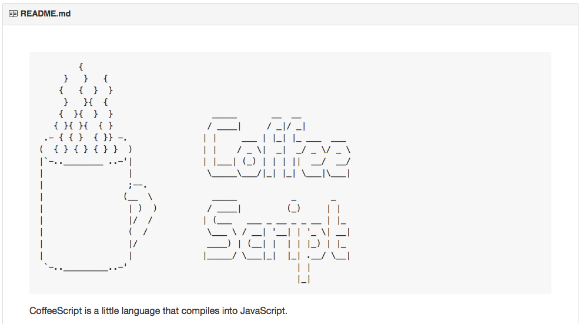

##  APEX fine art printing, Markdown überall
Ottmar Gobrecht  
DOAG APEX Connect 2016, Berlin

<!--slide-container-->

## Motivation

<!--slide-->

### Wiki-Fan, Projektanforderungen

- Editor mit Read-Only-Mode
- Harte Zeichenbegrenzung

<!--slide-container-->

## Was ist Markdown?

<!--slide-->

### Vereinfachte Auszeichnungssprache

HTML-Erstellung

<!--slide-->

### Ziel: Ohne Konvertierung leicht les- und schreibbar

<!--slide-->

### HTML = Publikations-Format

### Markdown = Schreib-Format

<!--slide-->

### Einflüsse: Text-Emails, Text-zu-HTML-Konverter

<!--slide-->

### Referenzimplementierung: 2004, John Gruber, Perl

<!--slide-->

### Weitere Implementierungen

- C
- PHP
- Python
- Go
- JavaScript
- Mehr Infos: [Wikipedia Markdown][1]

[1]: https://de.wikipedia.org/wiki/Markdown

<!--slide-->

### Syntax & Weiterentwicklungen

- John Gruber: [Markdown Basics (en)][1]
- John Gruber: [Markdown Syntax (en)][2]
- [Deutsche Übersetzung][3] von Grubers Original
- Wikipedia: [Auszeichnungsbeispiele][4]
- Wikipedia: [Weiterentwicklungen][5]

[1]: https://daringfireball.net/projects/markdown/basics
[2]: https://daringfireball.net/projects/markdown/syntax
[3]: http://markdown.de/syntax/index.html
[4]: https://de.wikipedia.org/wiki/Markdown#Auszeichnungsbeispiele
[5]: https://de.wikipedia.org/wiki/Markdown#Weiterentwicklungen

<!--slide-->

### Weitere vereinfachte Auszeichnungssprachen

- Wikis: [MediaWiki][1], [DokuWiki][2], [Creole][3]
- Foren: Quasistandard [BBCode][4]
- [Emacs][5] Erweiterung [Org-mode][6]
- Quellcode-Doku mit [POD][7] oder [Javadoc][8]
- [Textile][9], [AsciiDoc][10], [reStructuredText][11]
- ...

[1]: https://de.wikipedia.org/wiki/MediaWiki
[2]: https://www.dokuwiki.org/
[3]: https://de.wikipedia.org/wiki/Creole_(Markup)
[4]: https://de.wikipedia.org/wiki/BBCode
[5]: https://de.wikipedia.org/wiki/Emacs
[6]: https://de.wikipedia.org/wiki/Org-mode
[7]: https://de.wikipedia.org/wiki/Plain_Old_Documentation
[8]: https://de.wikipedia.org/wiki/Javadoc
[9]: https://de.wikipedia.org/wiki/Textile
[10]: https://de.wikipedia.org/wiki/AsciiDoc
[11]: https://de.wikipedia.org/wiki/ReStructuredText

<!--slide-->

### Fragen?

<!--slide-container-->

## Wer nutzt Markdown?

<!--slide-->

### Github: README.md Dateien werden direkt als HTML ausgeliefert

 <!-- .element: width="800px" -->

<!--slide-->

### Stackoverflow: Alle Einträge/Kommentare sind in Markdown verfasst

<!--slide-->

### Verlage & Autoren, die sowohl eBooks als auch klassischen Druck benötigen

Ein paar interessante Blog-Einträge zum Thema:

- Michael Kofler:
  - [Sackgasse LaTeX?][1]
  - [Kindle-eBooks mit Pandoc erstellen][2]
- Open Source Press:
  - [Bye-bye LaTeX!][3]
  - [AsciiDoc, Markdown & Co.][4]

[1]: https://kofler.info/sackgasse-latex/
[2]: https://kofler.info/kindle-ebooks-mit-pandoc-erstellen/
[3]: http://www.opensourcepress.de/de/blog/2013/05/bye_bye_latex.php
[4]: http://www.opensourcepress.de/de/blog/2013/05/asciidoc_markdown.php

<!--slide-->

### Die DPA veröffentlicht ihre Pressemitteilungen seit 2010 in Markdown

<!--slide-->

### Der Listmanager Trello nutzt Markdown auf Kartendetails

 <!-- .element: width="800px" -->

<!--slide-->

### Die Blogging Plattform Ghost setzt zu 100% auf Markdown

 <!-- .element: width="800px" -->

<!--slide-->

### Plugins für jedes wichtige CMS, Wiki oder Forum - auch für APEX [:-)][1]

 <!-- .element: width="800px" -->

[1]: https://apex.oracle.com/pls/apex/f?p=66154:1

<!--slide-->

### Jeder intuitiv, der einfachen Text strukturiert

<!--slide-->

### Fragen?

<!--slide-container-->

## Gründe für Markdown im APEX-Umfeld

<!--slide-->

### Rohtext gut lesbar in Datenbank und Userinterface

<!--slide-->

### Einfach prozedural erstellbar

<!--slide-->

### Textmengenvorgaben gut einhaltbar

<!--slide-->

### Geringere Datenmenge zum Browser

<!--slide-->

### Ein Quelltext, viele Ausgabeformate

Beispiel Formatkonverter [Pandoc][1]:

- HTML
- Word(docx), OpenOffice (odt)
- PDF
- E-Books (epub)
- Slideshows (HTML5 oder LaTeX)
- ...

[1]: http://pandoc.org/

<!--slide-->

### Übrigens, dieser Vortrag wurde in Markdown verfasst [:-)][1]

[1]: http://pandoc.org/README.html#producing-slide-shows-with-pandoc

<!--slide-->

### APEX Markdown Plugin in Action

[Demo...][1]

[1]: https://apex.oracle.com/pls/apex/f?p=66154:1

<!--slide-container-->

## APEX fine art printing

<!--slide-->

### Die Idee

- Markdown als Eingabeformat
- [Pandoc][1] als Konverter nach HTML, DOCX, PDF, ...
- [Node.js][2] als Web-Schnittstelle zu Pandoc
- Mehr zu [Pandocs Markdown][3]

[1]: http://pandoc.org/
[2]: https://nodejs.org/
[3]: http://pandoc.org/README.html#pandocs-markdown

<!--slide-->

### Fine art printing?

- Pandoc nutzt [LaTeX][1] zur PDF-Erstellung:
  - Textsatzsystem
  - Sauberes Schriftbild
  - Guter Formelsatz
  - Standard im Publikationsumfeld (Verlage, wissenschaftliche Arbeiten)

[1]: https://de.wikipedia.org/wiki/LaTeX

<!--slide-->

### Fine art printing in Action

Demo und Diskussion...

<!--slide-container-->

## Bonustrack

<!--slide-->

### Die Idee

- Markdown kennt Codeblöcke
- Codeblöcke können SQL Statements sein
- SQL Statements kann eine Datenbank ausführen
- Wer ahnt es schon?

<!--slide-->

### Eine Reporting-Engine basierend auf Markdown

- SQL-Code-Blöcke werden speziell markiert
- Hilfsfunktion ersetzt Blöcke durch Daten
- Ein [Pandoc-Filter][1] wandelt Daten in Charts
- Chart-Engine: Python [matplotlib][2], [pandas][3]
- Alles vektorbasiert und Open Source

[1]: http://pandoc.org/scripting.html
[2]: http://matplotlib.org/
[3]: http://pandas.pydata.org/index.html

<!--slide-->

### Was jetzt noch fehlt

- ~~Ein PL/SQL Package zur Wandlung der Code-Blöcke~~
- ~~Ein Pandoc-Filter~~
- ~~Eventuell eine Oberfläche zur Erstellung der Reports~~

<!--slide-->

### Markdown Reporter in Action (Prototyp)

Demo und Diskussion...

<!--slide-->

## The End

### Fragen?

[ogobrecht.github.io][1]

[1]: https://ogobrecht.github.io
