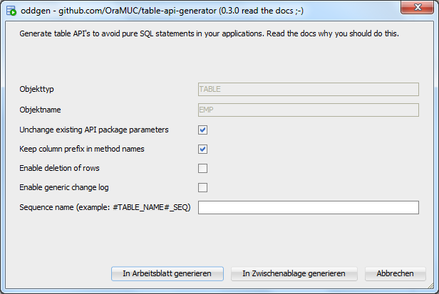

## Rethink Table API's, Fast Development, Secure Access
**André Borngräber, Ottmar Gobrecht**  
APEX Meetup 17.06.2016, Frankfurt

<!--slide-container-->

## Warum?

<!--slide-->

### Schnelligkeit

- Standardcalls für CRUD-Operationen
- Hilfsmethoden für eindeutige Schlüssel

<!--slide-->

### Lesbarkeit

- Kürzerer Code
- Einheitliche Methodennamen
- Wiedererkennungseffekte

<!--slide-->

### Wartbarkeit

- API's generierbar
- Strukturänderungen einfacher durchführbar
- Invalide API-Calls in Businesslogik schnell behebbar

<!--slide-->

### Sicherheit

- Trennung zwischen Daten- und UI-Schema einfach
- Löschen von Datensätzen abschaltbar

<!--slide-->

### Historisierung, Logging

- API feuert nur bei Änderungen
- Keine unnötigen Zeilen bei Updates

<!--slide-->

### Kompatibilität

- APEX Wizard getriebene Formulare werden unterstützt (Multirow-DML)
    - View und Instead Of Trigger werden generiert pro Tabelle
    - Trigger ruft API auf
	- APEX Prüfung auf veränderte Zeilen bleibt erhalten

<!--slide-->

### One Last Thing: Avoid Hard-Coding SQL

... [sagt Steven Feuerstein][1]

Keine versteckten DML Statements in APEX

- Prozessen
- Dynamic Actions
- Validierungen
- ...

[1]: https://www.toadworld.com/cfs-file/__key/communityserver-wikis-components-files/00-00-00-00-03/Say-Goodbye-to-Hard_2D00_Coding.pdf

<!--slide-container-->

## Wie?

<!--slide-->

### Open Source Projekt

[github.com/OraMUC/table-api-generator][2]

[2]: https://github.com/OraMUC/table-api-generator

<!--slide-->

PL/SQL & SQL Developer Integration ([oddgen][3])

```sql
begin
  om_tapigen.compile_only (p_table_name => 'EMP');
end;
```



[3]: https://www.oddgen.org/

<!--slide-->

### Features

- Generiert schmale, übersichtliche API-Packages
- Löschen von Zeilen kann deaktiviert werden
- Spalten- und zeilenbasierte CRUD-Methoden
- Getter und Setter für jede Spalte
- Optionales Sequence-Handling
- Optionales generisches Logging
- Hilfsfunktionen:
  - `row_exists`
  - `get_pk_by_unique_cols`

<!--slide-->

### Konventionen

Der API-Generator setzt aktuell voraus, dass ...

- ... es einen einspaltigen, numerischen Primärschlüssel gibt ([Surrogatschlüssel][4], kein [sprechender Schlüssel][5])
- ... fachliche Schlüssel als eindeutige Schlüssel definiert werden (optional, dann wird pro Unique Key eine `get_pk_by_unique_cols` Funktion erstellt)

[4]: https://de.wikipedia.org/wiki/Surrogatschl%C3%BCssel
[5]: https://de.wikipedia.org/wiki/Sprechender_Schl%C3%BCssel

<!--slide-container-->

## Beispiele

<!--slide-->

### Demozeit ...

<!--slide-container-->

## Nächste Schritte

<!--slide-->

### In Planung

- ~~Generierungsoptionen in API-Packages hinterlegen~~
- Dokumentation
- Logger-Integration
- Historisierung über Parameter aufnehmen? [Slowly Changing Dimensions (Typ 2)][6]
- Eure Wünsche und Ideen?
- ...

[6]: https://de.wikipedia.org/wiki/Slowly_Changing_Dimensions

<!--slide-->

## The End

### Fragen?

Euer [OraMUC-Team][7]  
André & Ottmar

[7]: https://github.com/OraMUC
