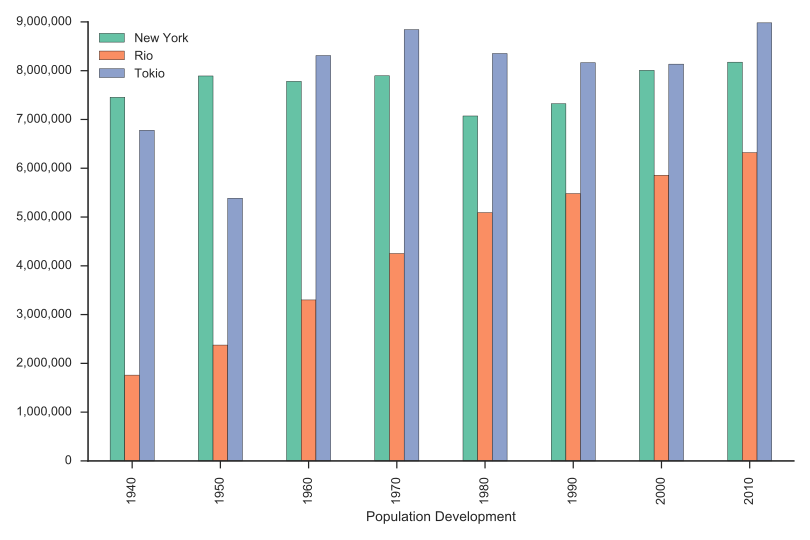
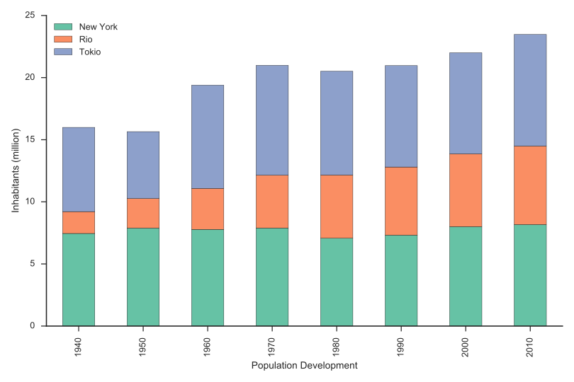
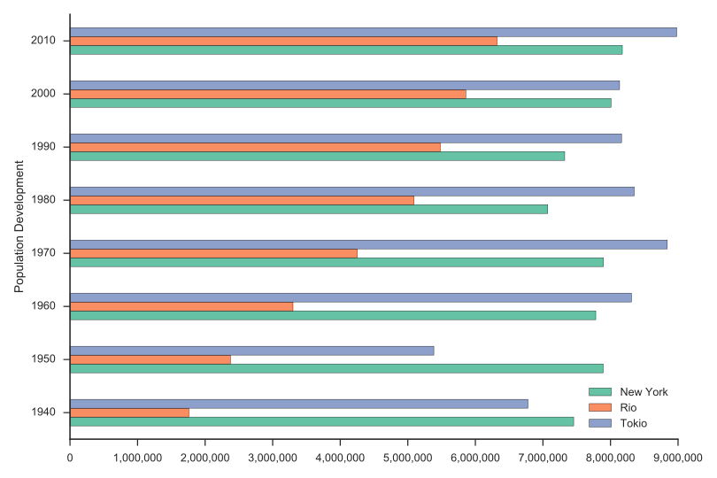

##  Reporting mal anders, Markdown sei Dank
**Ein Open Source Kochrezept**<br>
Ottmar Gobrecht<br>
DOAG Konferenz 2016, Nürnberg

---

### Motivation

- Wiki-Fan
- Markdown-APEX-Plugin
- Vorbereitung Vortrag APEX-Connect 2016
  - SQL-Code-Blöcke: Was tue ich da eigentlich?
  - Idee: **Markdown Reporter**

---

### Die Idee

- Markdown kennt Codeblöcke
- Codeblöcke können SQL Statements sein
- SQL Statements kann eine Datenbank ausführen
- Also los:
  - Codeblöcke durch Daten ersetzen
  - Daten in Charts wandeln
  - Fertig, jedenfalls theoretisch ...

---

### Warum Ein Kochrezept?

- Beispielimplementierung aus Open Source Komponenten
- Individuell anpassbar
- Keine Komponente größer als ein paar dutzend Zeilen Code
- Reporting ist ein hochgradig individuelles Thema
- Klingt wie kochen nach Rezept und anpassen an eigenen Geschmack, oder?

-----

## Ein Gruß aus der Küche

**Appetithäppchen**

---

### Beispieldaten

Einwohnerentwicklung New York, Rio, Tokio<br>
1940 - 2010

```
Population Development,New York,Rio,Tokio
1940,7454995,1759277,6778804
1950,7891957,2375280,5385071
1960,7781984,3300431,8310027
1970,7895563,4251918,8840942
1980,7071639,5090723,8351893
1990,7322564,5480768,8163573
2000,8008278,5857904,8134688
2010,8175133,6320446,8980768
```

---

<h3>Line Chart (<a href="javascript:to_svg()" title="Show SVG's for all eight example charts">SVG</a>/<a href="javascript:to_png()" title="Show PNG's for all eight example charts">PNG</a>)</h3>

 <!-- .element: width="810px" -->

---

<h3>Area Chart (<a href="javascript:to_svg()" title="Show SVG's for all eight example charts">SVG</a>/<a href="javascript:to_png()" title="Show PNG's for all eight example charts">PNG</a>)</h3>

 <!-- .element: width="810px" -->

---

<h3>Area Chart Stacked (<a href="javascript:to_svg()" title="Show SVG's for all eight example charts">SVG</a>/<a href="javascript:to_png()" title="Show PNG's for all eight example charts">PNG</a>)</h3>

 <!-- .element: width="810px" -->

---

<h3>Bar Chart (<a href="javascript:to_svg()" title="Show SVG's for all eight example charts">SVG</a>/<a href="javascript:to_png()" title="Show PNG's for all eight example charts">PNG</a>)</h3>

 <!-- .element: width="810px" -->

---

<h3>Bar Chart Stacked (<a href="javascript:to_svg()" title="Show SVG's for all eight example charts">SVG</a>/<a href="javascript:to_png()" title="Show PNG's for all eight example charts">PNG</a>)</h3>

 <!-- .element: width="810px" -->

---

<h3>Bar Chart Horizontal (<a href="javascript:to_svg()" title="Show SVG's for all eight example charts">SVG</a>/<a href="javascript:to_png()" title="Show PNG's for all eight example charts">PNG</a>)</h3>

 <!-- .element: width="810px" -->

---

<h3>Bar Chart Horizontal Stacked (<a href="javascript:to_svg()" title="Show SVG's for all eight example charts">SVG</a>/<a href="javascript:to_png()" title="Show PNG's for all eight example charts">PNG</a>)</h3>

 <!-- .element: width="810px" -->

---

<h3>Pie Chart (<a href="javascript:to_svg()" title="Show SVG's for all eight example charts">SVG</a>/<a href="javascript:to_png()" title="Show PNG's for all eight example charts">PNG</a>)</h3>

 <!-- .element: width="550px" -->

---

### System Overview


---

### APEX Demo

 <!-- .element: width="810px" -->

[Der Demo Report im PDF Format](./assets/demo-report.pdf)

-----

## Zutatenliste

**Selber Kochen**

---

### Überblick

- **Markdown** (Auszeichnungssprache)
- **Pandoc** (Formatkonverter)
- **LaTeX** (PDF-Erstellung)
- **Python Matplotlib, Pandas, Seaborn** (Chart-Generierung)
- IPython/Jupyter (Chart-Entwicklung)
- **Node.js** (Web-Fernsteuerung)
- **Markdown Reporter** (PL/SQL Datenlieferant)
- APEX (Reporterstellung/-verwaltung)

---

### Markdown

- Vereinfachte Auszeichnungsprache zur HTML Erstellung
- Definition: 2004, John Gruber, Aaron Swartz
- Ziel: Ohne Konvertierung leicht les- und schreibbar

```markdown
# Eine Überschrift

Ein kurzer Absatz.

* Ein Aufzählungspunkt
* Noch einer mit *kursivem* und **fettem** Text
```

---

### Markdown - Eine Abgrenzung

HTML = Publikations-Format<br>
Markdown = Schreib-Format

Komplette **ursprüngliche** [Syntax][1], [Weiterentwicklungen][2], das [APEX Plugin][3]

[1]: https://daringfireball.net/projects/markdown/syntax
[2]: https://de.wikipedia.org/wiki/Markdown#Weiterentwicklungen
[3]: https://apex.oracle.com/pls/apex/f?p=66154:1

---

### Pandoc

- Universeller Formatkonverter
  - Liest: Markdown, HTML, DocBook, LaTeX, DOCX, ODT, EPUB ...
  - Schreibt: XHTML, HTML (slide shows), PDF, RTF, DOCX, ODT, EPUB ...
- Kommandozeilentool (Windows, Mac OS X, Linux)
  - `pandoc demo.md --from=markdown --to=html --output=demo.html`
- [pandoc.org][4], [Pandoc's Markdown][5]

[4]: http://pandoc.org/
[5]: http://pandoc.org/MANUAL.html#pandocs-markdown

---

### LaTeX

- Makrosammlung (Textsatzsystem TeX)
- Guter Formelsatz, PDF-Export
- [latex-project.org][6], Wikipedia [en][7] [de][8]
- Distributionen: [MiKTeX][9], [TeX Live][10] ...

 <!-- .element: width="600px" -->

[6]: https://www.latex-project.org/
[7]: https://en.wikipedia.org/wiki/LaTeX
[8]: https://de.wikipedia.org/wiki/LaTeX
[9]: http://miktex.org/
[10]: http://www.tug.org/texlive/

---

### Python Matplotlib

- Programmbibliothek: Mathematische Darstellungen
- Exportformate: SVG, PDF, PNG ...
- [matplotlib.org][11], Wikipedia [en][12] [de][13]

 <!-- .element: width="600px" -->

[11]: http://matplotlib.org/
[12]: https://en.wikipedia.org/wiki/Matplotlib
[13]: https://de.wikipedia.org/wiki/Matplotlib

---

### Python Pandas

- Programmbibliothek: Datenstrukturen & Analyse
- Hochperformantes DataFrame Objekt ...
- [pandas.pydata.org][14], Wikipedia [en][15]

 <!-- .element: width="600px" -->

[14]: http://pandas.pydata.org/
[15]: https://en.wikipedia.org/wiki/Pandas_(software)

---

### Python Seaborn

- Programmbibliothek: Statistische Datenvisualisierung
- [stanford.edu/~mwaskom/software/seaborn][16]

 <!-- .element: width="600px" -->

[16]: https://stanford.edu/~mwaskom/software/seaborn/

---

### IPython/Jupyter

- Interaktive Shell (Client/Server Architektur)
- Browserbasiertes Notizbuch (JSON-Format)
- [ipython.org][17], Wikipedia [en][18] [de][19], [jupyter.org][20]

 <!-- .element: width="600px" -->

[17]: http://ipython.org/
[18]: https://en.wikipedia.org/wiki/IPython
[19]: https://de.wikipedia.org/wiki/IPython
[20]: http://jupyter.org/

---

### Node.js

- JavaScript Backend (Webserver, Laufzeitumgebung)
- Nonblocking Event Loop
- [nodejs.org][21], Wikipedia [en][22] [de][23]
- Paketmanager: [NPM][24]

 <!-- .element: width="600px" -->

[21]: https://nodejs.org/
[22]: https://en.wikipedia.org/wiki/Node.js
[23]: https://de.wikipedia.org/wiki/Node.js
[24]: https://www.npmjs.com/

---

### Markdown Reporter

- [github.com/ogobrecht/markdown-reporter][25]
- PL/SQL Helper Package
  - Führt Queries in Codeblöcken aus
  - Ersetzt Queries durch CSV Daten oder Markdown-Tabellen
  - Ruft Pandoc per HTTP Call auf
- Node.js-Fernsteuerung für Pandoc
  - Minimaler Webserver
  - Führt Pandoc als Shell-Befehl aus

[25]: https://github.com/ogobrecht/markdown-reporter

Anmerkung:

Node.js führt die gleichen Shellscripte aus, die man auch zur Entwicklung lokal ausführt. Es ist wirklich nur eine Fernsteuerung übers Web, weil in der Regel in einer Produktivumgebung die Möglichkeit fehlt, solche Dienste lokal auf dem Datenbankserver zu hosten. Das ist auch der Grund, warum jegliches Logging in der Node-App fehlt. Es darf ausschließlich von der Datenbank zugegriffen werden und etwaige Fehler können auf der Datenbank in eine Tabelle geschrieben werden.

Da die PDF-Erstellung in LaTeX recht aufwendig ist, sollte man überlegen, seitens der Datenbank die Anzahl der gleichzeitigen PDF-Erstellungen zu limitieren. Dies kann durch eine Jobsteuerung geschehen, was im Reporting-Umfeld ja sowieso oft der Fall ist.

Natürlich steht es jedem frei, alles nach seinen Wünschen anzupassen. Dies ist ja nur eine Beispielimplementierung, welche die Einstiegshürde in das Thema senken soll.

---

### APEX

Muss dazu noch etwas gesagt werden?

[apex.oracle.com][26]

[26]: https://apex.oracle.com/

---

### Fragen?

-----

## Vorbereitung

---

### Installation Basiskomponenten

- Unverbindlich: siehe "Geheimrezept für Windows"
- [Pandoc & LaTeX][27]
- [Node.js][28]
- [Python (3.5.x)][29], Upgrade Paketmanager pip:
    - Linux/OS X: `pip3 install -U pip`
    - Windows: `python -m pip install -U pip`
  - `pip3 install matplotlib`
  - `pip3 install pandas`
  - `pip3 install seaborn`
  - `pip3 install jupyter`

[27]: http://pandoc.org/installing.html
[28]: https://nodejs.org/en/download/
[29]: https://www.python.org/downloads/

Anmerkung:

Bei der Installation von seaborn unter Windows kann es zu folgendem Fehler kommen, wenn scipy installiert wird: `No Lapack/Blas Resources Found`. Dazu gibt es einen [Stackoverflow Beitrag][30] - hier (eine) mögliche Lösung in Kurzform:

- Zur eigenen Python-Version (32/64 bit) passende, vorkompilierte [Binärversion herunterladen][31]
- Installieren:  `pip install localDownloadedFileName`
- Danach sollte `pip install seaborn` klappen

Später habe ich dann bei der Anwendung von dem Pandoc Python Filter wieder einen Fehler bekommen, diesmal ging es um numpy+mkl - die Lösung ist fast die gleiche:

- Vorkompilierte [Binärversion herunterladen][32]
- Installieren:  `pip install localDownloadedFileName`

[30]: http://stackoverflow.com/questions/28190534/windows-scipy-install-no-lapack-blas-resources-found
[31]: http://www.lfd.uci.edu/~gohlke/pythonlibs/#scipy
[32]: http://www.lfd.uci.edu/~gohlke/pythonlibs/#numpy

---

### Installation Pandoc Fernsteuerung

- [Markdown Reporter][33] downloaden
  - entpacken, ins Rootverzeichnis wechseln
  - `npm install` (dort, wo package.json liegt)
  - `node app.js`
  - Im Browser [localhost:3000][34] aufrufen
  - mit [Pandoc example form][35] rumspielen

[33]: https://github.com/ogobrecht/markdown-reporter/releases/latest
[34]: http://localhost:3000
[35]: http://localhost:3000/pandoc/example-form

---

### Installation PL/SQL Helper Package

- Markdown Reporter Download, Unterverzeichnis `oracle_plsql`
- Kompilieren von markdown_reporter.pks/pkb
- Eventuell Anlage von Jobtabellen
- Reportverwaltung könnte in APEX stattfinden

-----

## Zubereitung

---

### Markdown Reporter - Demo Chart

    SELECT markdown_reporter.convert_document(
               p_format   => 'pdf' -- html, pdf, docx (with png's only)
             , p_markdown => markdown_reporter.preprocess_data(p_markdown => q'[
    ``` { .sql .chart .line caption="Demo Chart"}
    SELECT 1940 "Population Development", 7454995 "New York", 1759277 "Rio"
         , 6778804 "Tokio"              FROM dual UNION ALL
    SELECT 1950,7891957,2375280,5385071 FROM dual UNION ALL
    SELECT 1960,7781984,3300431,8310027 FROM dual UNION ALL
    SELECT 1970,7895563,4251918,8840942 FROM dual UNION ALL
    SELECT 1980,7071639,5090723,8351893 FROM dual UNION ALL
    SELECT 1990,7322564,5480768,8163573 FROM dual UNION ALL
    SELECT 2000,8008278,5857904,8134688 FROM dual UNION ALL
    SELECT 2010,8175133,6320446,8980768 FROM dual;
    ```
    ]'))
      FROM dual;

[Das Ergebnis dieser Query](./assets/demo-chart.pdf)

---

### Eingangsdaten Pandoc

```sql
SELECT markdown_reporter.preprocess_data(p_markdown => '...')
  FROM dual;
```

    ``` { .sql .chart .line caption="Demo Chart"}
    "Population Development","New York","Rio","Tokio"
    "1940","7454995","1759277","6778804"
    "1950","7891957","2375280","5385071"
    "1960","7781984","3300431","8310027"
    "1970","7895563","4251918","8840942"
    "1980","7071639","5090723","8351893"
    "1990","7322564","5480768","8163573"
    "2000","8008278","5857904","8134688"
    "2010","8175133","6320446","8980768"
    ```

---

### Pandoc Filter

Die ganze Magie findet in einem [Pandoc Filter][36] statt

- Pandoc wandelt Markdown in Zwischenformat JSON
- Über Zwischenformat iteriert der Filter
- Code-Blöcke mit Klassen SQL & Chart werden aufbereitet
- Diese Aufbereitung können wir ergänzen

[36]: http://pandoc.org/scripting.html

---

### Pandoc Filter - Beispiel Line Chart

```python
# read csv data from code block
df = pd.read_csv(StringIO( code ), index_col=0, parse_dates=True)
# create chart
if charttype == 'line':
    ax = df.plot.line(subplots=False, figsize=(width/96, height/96), \
    legend=legend) # size must be given in inches, default is 96 dpi
#---<snip>-----------------------------------------------------------
# set title and axis labels
if title != '':
    ax.set_title(title)
#---<snip>-----------------------------------------------------------
# clean up chart with seaborn despine method
sns.despine()
# save chart
plt.savefig(filename)
```

[Der komplette Filter][37]

[37]: https://github.com/ogobrecht/markdown-reporter/blob/master/pandoc_filter/pandocFilterMarkdownReporter.py

---

### Chartentwicklung mit Jupyter

Jupyter Start mit Shellaufruf:
```python
jupyter notebook
```

 <!-- .element: width="600px" -->

[Jupyter-Docs][38],
[Das Notizbuch aus dem Markdown Reporter Projekt][39]

[38]: http://jupyter.readthedocs.io/en/latest/running.html
[39]: https://github.com/ogobrecht/markdown-reporter/blob/master/docs/markdown-reporter.ipynb

---

### Jupyter Notebook

Notebook Schritt für Schritt ausführen

 <!-- .element: width="600px" -->

---

### Jupyter Demo

---

### Fragen?

-----

## Geheimrezept für Windows

---

### Alles ohne Installation

Für einen unverbindlichen Test oder eine temporäre Entwicklungsumgebung ohne Adminrechte:

- Pandoc: `msiexec /a pathToMsiFile /qb TARGETDIR=pathToTargetDir`
- Full Python Stack: [winpython.github.io][40]
- LaTeX: [miktex.org/portable][41]
- Node.js: [gareth.flowers/nodejs-portable][42]

[40]: https://winpython.github.io/
[41]: http://miktex.org/portable
[42]: http://gareth.flowers/nodejs-portable/

Anmerkung:

Natürlich muß man sich selbst um die Pfadangaben kümmern, wenn man alles portabel installiert - aber man kann sich ja mit Batchdateien aushelfen - hier ein Beispiel:

```
echo off
cls

if [%1]==[] echo Please provide the desired target format as a parameter - example: convert html & goto end

set       format=%1
set filterformat=%1
set       filter=..\..\pandoc_filter\pandocFilterMarkdownReporter.py
set      datadir=..
set       pandoc=c:\og\PortableApps\pandoc\pandoc.exe
set       python=c:\og\PortableApps\python\python-3.5.2.amd64\python.exe
set        latex=c:\og\PortableApps\miktex\miktex\bin\lualatex.exe

rem remove the first parameter (the format)
shift
rem fill var params with remaining parameters
set params=%1
:loop
shift
if [%1]==[] goto afterloop
set params=%params% %1
goto loop
:afterloop

rem ensure the same format names like pandoc - for PDF files the output format is latex!
if %format%==pdf set filterformat=latex

echo generate JSON source...
%pandoc% document.md --from=markdown --to=json --output=document.json %params%

echo apply filter (generate charts from relevant code blocks)...
%python% %filter% %filterformat%

echo generate target document...
if %format%==html %pandoc% document.filtered.json --from=json --to=html --output=document.html --data-dir=%datadir% --self-contained --standalone  %params%
if %format%==docx %pandoc% document.filtered.json --from=json --to=docx --output=document.docx --data-dir=%datadir% %params%
if %format%==pdf  %pandoc% document.filtered.json --from=json --to=latex --output=document.pdf --data-dir=%datadir% --latex-engine=%latex% %params%

:end
```

---

### Portable Stolperfallen - MikTeX

- Will zur Laufzeit nachinstallieren
  - Autoinstall einschalten
  - Proxy konfigurieren
  - Repository einstellen
- Genutzte Features immer lokal testen

---

## The End

### Fragen?

[ogobrecht.github.io][43]

[43]: https://ogobrecht.github.io
