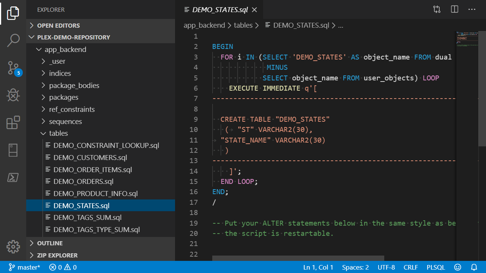

<!-- .slide: data-background-image="/assets/images/braden-collum-87874-unsplash.jpg" -->

# Schnellstart
## Versionskontrolle für existierende Oracle Projekte

Ottmar Gobrecht &nbsp;&nbsp;&nbsp;[@ogobrecht](https://twitter.com/ogobrecht)

DOAG Konferenz Nürnberg<br>
<span>19. November 2019</span>

---

## Zu meiner Person
- Oracle APEX Entwickler seit 2008 (APEX 3.1)
- Seit 2013 im Headquarter der Linde AG
- Individualsoftware für Fachbereiche
- Aktiv im [Open Source Bereich](https://github.com/ogobrecht)

---

## Zu Eurer Person
- Wer nutzt Versionskontrolle?<!-- .element: class="fragment"-->
- Wer nutzt Git? SVN? Etwas anderes?<!-- .element: class="fragment"-->
- Wer verskriptet seine Releases?<!-- .element: class="fragment"-->
- Wer hat CI/CD implementiert?<!-- .element: class="fragment"-->

-----

<!-- .slide: data-background-image="/assets/images/danielle-macinnes-IuLgi9PWETU-unsplash.jpg" -->

# Motivation

---

<!-- .slide: data-background-image="/assets/images/michael-d-beckwith-575798-unsplash.jpg" -->

> „There is no clean (database) development without Version Control“
>
> Samuel Nitsche ([Blog Post](https://cleandatabase.wordpress.com/2017/09/22/there-is-no-clean-database-development-without-version-control/))

---

<!-- .slide: data-background-image="/assets/images/stephen-radford-hLUTRzcVkqg-unsplash.jpg" -->

## Deployment Pain?!?

---

## Just Do It


<small>Tweet vom 7. Oktober 2019</small>

---

## Unser Ziel

„All in one“ Export für Versionskontrolle

- Backend (Schema DDL)<!-- .element: class="fragment"-->
- Daten (Katalogdaten)<!-- .element: class="fragment"-->
- Frontend (APEX App, zerlegt)<!-- .element: class="fragment"-->
- Deployment Templates<!-- .element: class="fragment"-->
- Wiederanlauffähigkeit<!-- .element: class="fragment"-->
- Übersichtliche Dateistruktur<!-- .element: class="fragment"-->


---

## Gewünschte Verzeichnisstruktur


<small>Kurze Wege, alle Skripte vereint, übersichtlich</small>

-----

<!-- .slide: data-background-image="/assets/images/clark-young-135435-unsplash.jpg" -->

# Tools

---

## Tool-Vergleich DDL Export - Kriterien

**Tools: SQL Dev, PL/SQL Dev, Toad, PLEX**<!-- .element: class="fragment"--><b style="color:red;">?!?</b><!-- .element: class="fragment"-->

- Eine Skript-Datei pro Objekt<!-- .element: class="fragment"-->
- Unterverzeichnisse pro Objekttyp<!-- .element: class="fragment"-->
- Eigene Dateien FK Constraints<!-- .element: class="fragment"-->
- "Object already exist" verhinderbar<!-- .element: class="fragment"-->
- Daten exportierbar<!-- .element: class="fragment"-->
- APEX App exportierbar<!-- .element: class="fragment"-->

---

## Tool-Vergleich DDL Export

| Kriterium             | SQL<br>Dev. | PL/SQL<br>Dev. | Toad       | PLEX    |
|-----------------------|-------------|----------------|------------|---------|
| Datei pro Objekt      | Ja          | Ja             | Ja         | Ja      |
| Unterverz. pro Typ    | Ja          | Nein           | Ja         | Ja      |
| FK Constr. extra      | Ja          | Nein           | Ja         | Ja      |
| Verhi. object exist   | Nein        | Nein           | Nein       | Ja      |
| Export Daten          | Ja          | Nein           | ***Jein*** | Ja      |
| Export APEX App       | Ja          | Nein           | Nein       | Ja      |

---

## Anmerkungen PLEX
- Ist ein Package (<span style="color:red;">PL</span>/SQL <span style="color:red;">Ex</span>port Utilities)
- Ausgabeverzeichnisstruktur anpassbar
- APEX App zerlegt<br>(Änderungen im VCS nachvollziehbar)
- [Projekt auf GitHub](https://github.com/ogobrecht/plex)
- Wenig Nacharbeit erforderlich

---

## Anmerkungen Toad 
- Zwei Exportmöglichkeiten (mindestens)
  - Entweder Unterverzeichnisse pro Objekttyp...
  - ... oder Daten
- Daten nur als Insert Statements
- Umfangreich konfigurierbar, unübersichtlich
- Viel Nacharbeit erforderlich

---

## Anmerkungen PL/SQL Developer
- Wenig konfigurierbar
- Enttäuscht für Aufbau Quellcode-Repos
- Viel Nacharbeit erforderlich

---

## Anmerkungen SQL Developer
- Ist am übersichtlichsten
- Viele Formate für Datenexport (auch CSV)
- Umfangreich konfigurierbar
- Blain Carter: [CI/CD for Database Developers – Export Database Objects into Version Control](https://learncodeshare.net/2018/07/16/ci-cd-for-database-developers-export-database-objects-into-version-control/)
- Nacharbeit erforderlich

---

<!-- .slide: data-background-image="/assets/images/camylla-battani-784361-unsplash.jpg" -->

## Fragen?

-----

<!-- .slide: data-background-image="/assets/images/gabriel-gabriel-wVB8tH5_L9s-unsplash.jpg" -->

# PLEX

---

## Ausgangsbasis: Sample DB App


---

## Möglicher Erstexport

```sql
WITH
  FUNCTION backapp RETURN BLOB IS
  BEGIN
    RETURN plex.to_zip(plex.backapp(
      p_app_id               => 100,
      p_include_object_ddl   => true,
      p_object_name_not_like => 'PLEX',
      p_include_templates    => true,
      p_include_runtime_log  => true,
      p_include_data         => true,
      p_data_table_name_like => 'DEMO_PRODUCT_INFO,DEMO_STATES'
    ));
  END backapp;

SELECT backapp FROM dual;
```

[Blog Post](https://ogobrecht.github.io/posts/2018-08-26-plex-plsql-export-utilities/)

---

## Demo

Create Repo & Export App

---

## Speichern als ZIP


---

## Das entpackte ZIP File


---

## Backend


---

## Katalogdaten


---

## Frontend zerlegt


---

## Backend Master Script


---

## Frontend Master Script


---

## Deployment Templates


---

## Templates Kopiert & Angepasst


---

## Zukünftige Exporte Konfigurieren


---

## Deployment Master Script 1/2


---

## Deployment Master Script 2/2


---

<!-- .slide: data-background-image="/assets/images/kevin-grieve-660962-unsplash.jpg" -->

## Fragen?

-----

<!-- .slide: data-background-image="/assets/images/andrea-cappiello-770323-unsplash.jpg" -->

# DDL
## <span style="color:red;">D</span>urch <span style="color:red;">d</span>ie <span style="color:red;">L</span>andschaft ;-)
<!-- .element: class="fragment"-->

Von DEV über INT nach PROD
<!-- .element: class="fragment"-->

---

## Ab hier dateibasiertes Arbeiten
- Keine Änderungen über Klickibunti-Tools<!-- .element: class="fragment"-->
- Alle Änderungen per Skript<!-- .element: class="fragment"-->
- Nur noch deklarativen Code exportieren<!-- .element: class="fragment"-->
  - APEX-Frontend<!-- .element: class="fragment"-->
  - ORDS-REST-Services<!-- .element: class="fragment"-->
  - ...<!-- .element: class="fragment"-->

---

## Wiederanlauffähigkeit



---

## Die Idee hinter der Skripterei

- Agile DB-Entwicklung<!-- .element: class="fragment"-->
- Jede Änderung ist eine Migration<!-- .element: class="fragment"-->
  - [Wikipedia: Schema migration](https://en.wikipedia.org/wiki/Schema_migration)
  - [Artikel Samuel Nitsche](https://cleandatabase.wordpress.com/2017/11/28/one-does-not-simply-update-a-database-migration-based-database-development/)
  - [Artikel Martin Fowler](https://www.martinfowler.com/articles/evodb.html)


<small>Unser Ansatz ist nur eine mögliche Ausprägung der Idee</small><!-- .element: class="fragment"-->

---

<!-- .slide: data-background-image="/assets/images/kawtar-cherkaoui-125346-unsplash.jpg" -->

## Fragen?

-----

<!-- .slide: data-background-image="/assets/images/james-thomas-125093-unsplash.jpg" -->

# Geschwindigkeit

---

## Mehrarbeit, die sich auszahlt
- Nur Skripte<!-- .element: class="fragment"-->
- Kein manueller App Export/Import<!-- .element: class="fragment"-->
- Alle Skripte wiederanlauffähig<!-- .element: class="fragment"-->
- Gesamtablauf getestet<!-- .element: class="fragment"-->
- Reduzierte „Deployment Pain“<!-- .element: class="fragment"-->

---

## Demo 

APEX Export & Deployment

---

## Apropos Deployment Pain
- Jede Umgebung ist individuell<!-- .element: class="fragment"-->
- Mit den Skripten anfangen<!-- .element: class="fragment"-->
- Kleine Schritte<!-- .element: class="fragment"-->
- Immer besser werden<!-- .element: class="fragment"-->
- Nicht stehenbleiben<!-- .element: class="fragment"-->

---

<!-- .slide: data-background-image="/assets/images/wayne-bishop-5737-unsplash.jpg" -->

## Fragen?

-----

<!-- .slide: data-background-image="/assets/images/ricky-kharawala-308072-unsplash.jpg" -->

# Mehr Tools

---

## Git versus SVN
- Git ist schneller
- SVN braucht weniger Platz
- Git funktioniert offline
- SVN Rechteverwaltung ist flexibler
- Entscheidungshilfe: [Artikel zum Thema](https://entwickler.de/online/development/git-subversion-svn-versionskontrollsystem-579792227.html)
- Tipp Windows Server: [Git](https://gitea.io/), [SVN](https://www.visualsvn.com/server/)

---

## GitHub Desktop
- Multi-Plattform (Linux in Arbeit)
- Reduziert auf das Wesentliche
- Übersichtlich
- Funktioniert mit eigenen Git-Servern
- [Homepage](https://desktop.github.com/)

---

## GitHub Desktop


---

## Visual Studio Code
- Multi-Plattform
- Git integriert
- Terminal Integriert
- [PL/SQL Unterstützung](https://github.com/zabel-xyz/plsql-language)
- [Homepage](https://code.visualstudio.com/)

<small>Morten Braten: [Using VS Code for PL/SQL development](https://ora-00001.blogspot.com/2017/03/using-vs-code-for-plsql-development.html)</small>

---

## Visual Studio Code


---

## Liquibase

> „Database schema change management“

- In SQLcl integriert (v19.2+)
- Jeff Smith: [Liquibase and SQLcl](https://www.thatjeffsmith.com/archive/2019/09/liquibase-and-sqlcl/)
- [www.liquibase.org](https://www.liquibase.org/)

---

<!-- .slide: data-background-image="/assets/images/alexander-andrews-511680-unsplash.jpg" -->

## Fragen?

-----

<!-- .slide: data-background-image="/assets/images/matt-lamers-683008-unsplash.jpg" -->

# Fazit

---

## Die Reise hat begonnen

1. ~~Versionsverwaltung~~
2. Deployment-Automatisierung<!-- .element: class="fragment"-->
3. Continuous Integration<!-- .element: class="fragment"-->
4. Trunk-basierte Entwicklung<!-- .element: class="fragment"-->
5. Testautomatisierung<!-- .element: class="fragment"-->
6. ...<!-- .element: class="fragment"-->

<small>Siehe Anhang „DevOps“</small><!-- .element: class="fragment"-->

---

## Weitergedacht

Versionskontrolle nach DevOps meint<br>
„Alle Produktionsartefakte“

- ~~Anwendungscode~~
- Build-Skripte<!-- .element: class="fragment"-->
- Deployment Pipelines<!-- .element: class="fragment"-->
- Systemkonfigurationen<!-- .element: class="fragment"-->
- ...<!-- .element: class="fragment"-->
- Kurz: Infrastruktur als Code<!-- .element: class="fragment"-->

<small>Übrigens: Diese Folien sind auch Code - geschrieben in Markdown</small><!-- .element: class="fragment"-->

---

## Lesestoff 1

- Ottmar Gobrecht: [PLEX - PL/SQL Export Utilities](https://ogobrecht.github.io/posts/2018-08-26-plex-plsql-export-utilities/) & [Schnellstart - Versionskontrolle für existierende Oracle-Projekte](https://ogobrecht.github.io/posts/2019-07-20-schnellstart-versionskontrolle-fuer-oracle-projekte/)
- Samuel Nitsche: [There is no clean (database) development without Version Control](https://cleandatabase.wordpress.com/2017/09/22/there-is-no-clean-database-development-without-version-control/) & [“One does not simply update a database” – migration based database development](https://cleandatabase.wordpress.com/2017/11/28/one-does-not-simply-update-a-database-migration-based-database-development/)

---

## Lesestoff 2

- Blain Carter: [Tips to help PL/SQL developers get started with CI/CD](https://learncodeshare.net/2018/04/30/tips-to-help-pl-sql-developers-get-started-with-ci-cd/) & [CI/CD for Database Developers – Export Database Objects into Version Control](https://learncodeshare.net/2018/07/16/ci-cd-for-database-developers-export-database-objects-into-version-control/)
- Denis Savenko: [Oracle APEX and ORDS deployments automation](https://dsavenko.me/apex-and-ords-deployments-automation/)

---

## Lesestoff 3

- Martin Fowler: [Evolutionary Database Design](https://www.martinfowler.com/articles/evodb.html)
- Jeff Smith: [Liquibase and SQLcl](https://www.thatjeffsmith.com/archive/2019/09/liquibase-and-sqlcl/)
- Antti Kirmanen: [Git vs. Subversion (SVN): Welches Versionskontrollsystem sollten Sie nutzen?](https://entwickler.de/online/development/git-subversion-svn-versionskontrollsystem-579792227.html)
- Morten Braten: [Using VS Code for PL/SQL development](https://ora-00001.blogspot.com/2017/03/using-vs-code-for-plsql-development.html)


---

<!-- .slide: data-background-image="/assets/images/nick-de-partee-97063-unsplash.jpg" -->

# The End

## Fragen?

&nbsp;

Folien: [ogobrecht.github.io](https://ogobrecht.github.io)

[Hintergrundfotos von unsplash.com](https://unsplash.com/collections/4373998)

-----

# Anhang - DevOps

---

## DevOps - Statistiken

Leistungsstarke gegenüber leistungsschwachen Unternehmen laut [State of DevOps Report 2017](https://puppet.com/resources/whitepaper/2017-state-of-devops-report)

- 46-mal häufigere Code Deployments
- 440-mal schneller von Commit zu Deployment
- 96-mal schnellere Wiederherstellung nach Ausfällen
- 5-mal niedrigere Ausfallrate bei Änderungen

---

## Kann man das glauben?

Buchtip: [Das Mindset von DevOps - Accelerate](https://www.heise.de/developer/artikel/Das-Mindset-von-DevOps-Accelerate-4495067.html)

- Performance der Softwarebereitstellung
- 24 Schlüsselkompetenzen in 5 Kategorien
- Wissenschaftlich belegt

<small>Der Kern: Auf Kompetenzen, nicht auf Reife fokussieren.<br>
Verbesserungen kontinuierlich vorantreiben.</small>

---

## Die Kompetenz-Kategorien

1. Continuous Delivery
2. Architektur
3. Produkt und Prozess
4. Lean Management und Monitoring
5. Kultur

---

## Continuous Delivery-Kompetenzen

Die ersten Schritte

1. Versionsverwaltung
2. Deployment-Automatisierung
3. Continuous Integration
4. Trunk-basierte Entwicklung
5. Testautomatisierung
6. ...

---

## Kulturelle Kompetenzen - Beispiel

<small>Kapitel 11: Führungskräfte und Manager, Transformationale Führung</small>

> „Ermutigen Sie Ihre Belegschaft, mindestens einmal im Jahr technische Konferenzen zu besuchen und das dort Gelernte für das gesamte Team zusammenzufassen.“

---

## Lesestoff

- Buchtip Heise Developer: [Das Mindset von DevOps - Accelerate - 24 Schlüsselkompetenzen, um leistungsstarke Technologieunternehmen zu entwickeln und zu skalieren](https://www.heise.de/developer/artikel/Das-Mindset-von-DevOps-Accelerate-4495067.html)
- Gareth Rushgrove: [Macht DevOps Unternehmen erfolgreicher?](https://www.silicon.de/41661475/macht-devops-unternehmen-erfolgreicher)
- Puppet: State of DevOps Report [2017](https://puppet.com/resources/whitepaper/2017-state-of-devops-report), [2018](https://puppet.com/resources/whitepaper/2018-state-of-devops-report), [2019](https://puppet.com/resources/whitepaper/state-of-devops-report)

